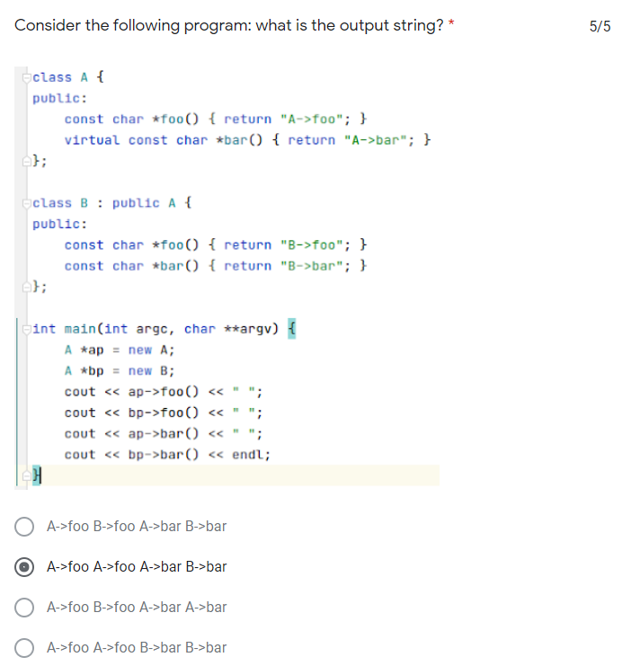
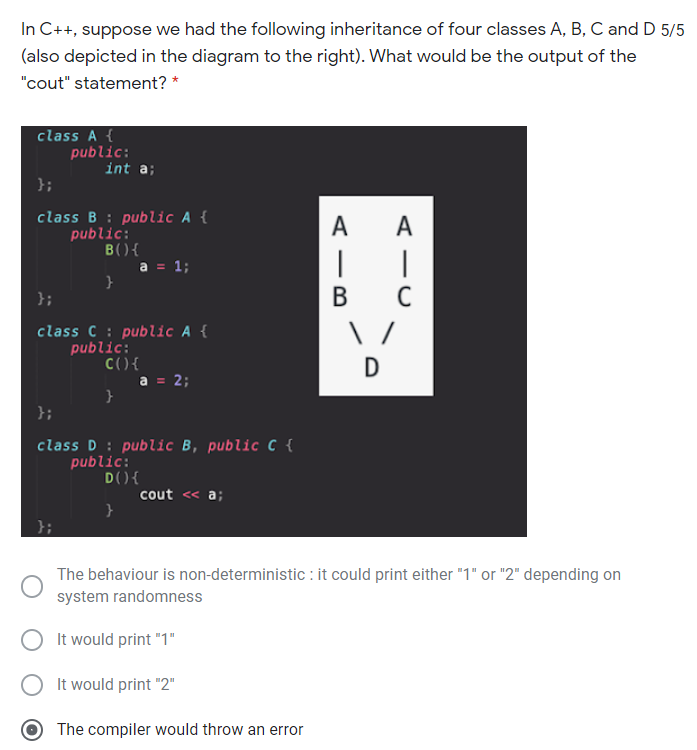

### protected

在之前我们知道，区分public和private的动机是类设计者希望对用户暴露一些想让用户使用的成员，对于类的某些成员，类的设计者可能不想让用户进行访问，因此使用private对其进行保护。

而protected访问说明符的出现是服务于继承这个背景的。会有这样的一类基类成员：类设计者想让其派生类继承，但是不想让用户使用。由此就有了protected

它兼容了public和private的两方面特性：从用户角度来看，protected继承了private不可访问的特性。从派生类的角度看，protected继承了public可以被派生类继承的特性。

| 访问说明符 | 能否被用户使用 | 能否被友元使用 | 能否被派生类继承 |
| ---------- | -------------- | -------------- | ---------------- |
| public     | Y              | Y              | Y                |
| protected  | N              | Y              | Y                |
| private    | N              | N              | N                |

换个角度想的话，protected与public唯一的区别是不能被用户使用，其他就可以看作是public的


#### 派生访问说明符

派生类能够继承基类所有的public和protected成员，这一点是我们之前就知道的，与派生访问说明符无关。**访问说明符控制的是派生类继承了基类的成员之后，该部分成员将作为派生类的哪部分成员出现。**

```c++
例如
class Base{
protected:
	int val;
};
class pub_Base:public Base{

};
class pri_Base:private Base{

};
class pro_Base:protected Base{

};
对于pub_Base 使用public派生访问说明符，继承的val可以将其看作是public成员。
对于pri_Base和pro_Base 使用private和protected派生访问说明符，继承的val分别是其private和protected成员，不能被派生类对象访问。
```


### 重载，作用域，覆盖与继承

##### 静态名称查找机制

在同一个作用域使用某变量名，编译器会优先在本作用域中查找该名字，如果没找到，继续在外层作用域中寻找。直至全局作用域。如果在全局作用域中都未找到该名字，那么编译器就会报错，称未定义该名称的变量。

基于这一特性，假设内层作用域中声明了一个变量，其变量名与外层作用域某变量相同，则编译器必然会优先找到内层作用域的该变量，而不会使用外层作用域的对象，我们称这种行为覆盖了外层作用域的变量。

编译器优先在内层中寻找变量，这一阶段仅进行名字查找。一旦找到同名变量，会马上进行类型匹配，匹配失败直接报错，不会有继续在外层作用域中寻找的机会。

##### 一个例外 ：函数重载

在同一个作用域中，我们只允许定义一个同名变量。但是有一个例外，C++允许我们定义同名的函数，这些函数在形参类型或形参数量上必然有所区别，我们称为函数重载。

同一层除了函数重载，不可以存在同名变量。

##### 在有继承关系的类中的名字查找过程  p->mem()  obj.mem()

**我们可以认为派生类处于基类的内层作用域。**那对于继承类中名字该如何查找呢？

1. 首先确定p或obj的静态类型。在其静态类型的成员中查找该名字，如果找不到就继续在其直接基类中查找，直至继承链的顶端。若还没有找到，编译器报错。

> 这个找的过程只能查找显式在类中出现过的声明。对于对于继承自基类的成员我们认为其并不在派生类的作用域内。

2. 一旦找到该名字，立即进行类型匹配。类型匹配失败，则编译器报错。

3. 如果类型匹配正确，编译器将会查看该函数是否被声明为虚函数：

如果不是虚函数，就会立即绑定。如果是虚函数，就会动态绑定。

> 注意这里不要钻入牛角尖：对于未重写虚函数的派生类，其能够调用的虚函数确实不在本作用域内，如果这时派生类内还定义了一个与虚函数同名的普通函数，不要认为在动态绑定时该普通函数会对虚函数进行覆盖，进而导致无法访问到基类的虚函数！
>
> 这里可以这样理解：覆盖机制只适用于静态绑定期，一旦该函数进行了动态绑定，那么它能够忽略覆盖机制找到其想要的虚函数定义。

因此，对于派生类，最好不要定义与继承而来的成员重复的名字。

- 如果与基类普通成员重名，意味着在该派生类中对其进行了隐藏。必须通过显式的作用域符才能够访问到基类中的该同名函数。

- 如果与虚函数重名同参，意味着对虚函数进行了重写。这是我们允许且欢迎的行为。

- 如果对与虚函数同名不同参（程序员主观上认为这与虚函数是不同的两个函数）

如果没有重写虚函数，该普通函数对基类虚函数进行了隐藏，那么无法通过d1访问到基类的虚函数，。

如果重写了虚函数，那么虚函数和该同名普通函数都是可见的，编译器会认为它们是重载函数。


因此，在类中定义与虚函数同名的普通函数，尤其是该派生类并未重新定义虚函数的情况下，
是危险的！

这就是本来就存在的同名覆盖机制的作用。
虚函数本身出现的目的就是为了让派生类进行覆盖的。因此这里的覆盖是机制的合理利用。


##### vitual关键字的作用与动态绑定

正常情况下，当我们使用某类型的对象，指针或引用调用该对象的方法，在编译阶段编译器就根据对象，指针或引用的静态类型，帮我们确定所调用函数的具体位置。

但如果将一个函数设定为虚函数，就是在告诉编译器，不要通过静态类型确定调用哪个函数。 要根据运行时具体的动态类型确定调用函数的具体位置。通过这种方式，我们实现了动态绑定。

如果没有通过vitual关键字来确保以上机制，那就不会存在动态绑定。

**看下面题目：**



这道题就考察了动态绑定与静态绑定的区别。对于virtual声明过的虚函数，编译器会执行动态绑定。即在代码执行时，根据对象的实际类型执行。而对于非虚函数，编译器在编译阶段就会根据对象的类型直接确定其应该执行的是哪个函数。

在本题中，声明两个A类型的指针ap和bp。A类型的foo函数，是非虚函数，因此编译器对ap->foo()和bp->foo()，直接静态绑定。由于ap和bp都是A类型的指针，所以全部绑定到A类型的foo函数。

A类型的bar函数，是虚函数。因此执行动态绑定，ap实际指向A类型对象，因此执行A->bar(),bp实际指向B类型对象，因此执行B->bar()

有了这个功能我们就可以实现：

使用泛型类型的变量，执行派生类定制化的代码。

这样有什么好处呢？

设想，如果没有动态绑定的功能。派生类对基类的方法进行了改写，但是这时我们只能通过派生类类型的变量去访问这个定制化的方法。

如果这样的话，基类，派生类， 继承这一系列概念仅仅是为了简化派生类的代码。在使用中，我们仍然将它们当做两个互不相关的类去对待。

==这样的语法如果没有，会导致错误还是麻烦？==

**我的猜想：这甚至违反了OOP的初衷。在使用中当做两个互不相关的类**


我们想要实现的愿望：

1. 基类的指针和引用可以绑定派生类对象。（在语法中实现）

2. 若第一点实现，我们想要在使用基类的指针和引用时，根据其所绑定的对象调用其自定义的方法。

```c++
StrVec *p=new StrVec;
p->push_back("hello");
p->size();
```

例如上例，在无法做到第二点的时候，编译器在编译时就确定p所调用的函数是在StrVec中定义的push_back函数和size函数。如果StrVec有派生类，并且覆盖了push_back和size函数，那必须使用指向该派生类的指针或引用或对象才能够真正使用覆盖后的方法。但是这样做就少了很多的灵活性。我们之所以让某一个类继承另一个类，那是因为该类之间是存在某种从属关系的，基类代表一个大的分支，而派生类是基于大的分支而演化成的很多小分支。而派生类所覆盖的基类的方法，一般都是对“模板化”内容的“具体化”。既然如此，以基类为首的这一簇相关的类构成了一个大类。我们希望

 

#### 多重继承

一个派生类对象拥有多个基类的成员。 不同名成员访问不会出现二义性； 如果不同的基类拥有**同名成员**， 派生类对象访问时应该加以识别。

https://blog.csdn.net/luoweifu/article/details/46959173



